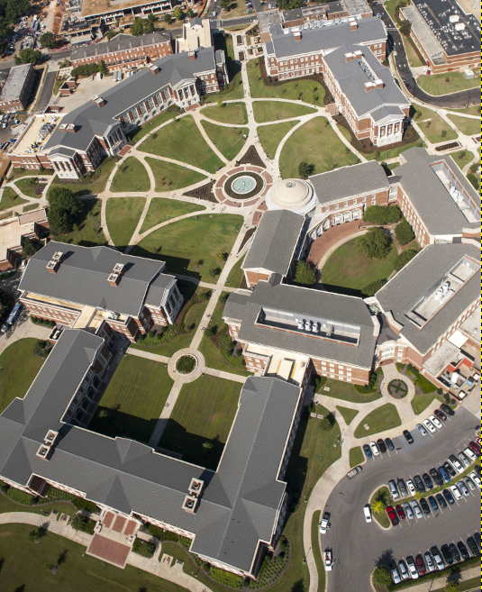
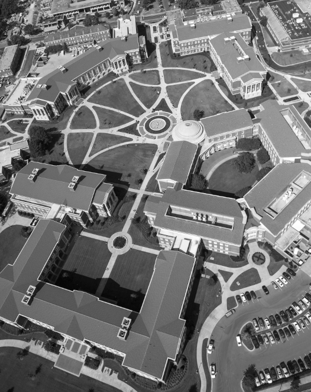

This program makes use of structures and some functions
in order to convert a ppm image into a grayscale pgm image.  
 
You can run the code by using the following format :  

**./Image [method] [ppm_filename] [pgm_filename]**

Acceptable methods are red, green, blue, average, lightness and luminosity.

1.	red (use the red intensity as the grayscale intensity)
2.	green (use the green intensity as the grayscale intensity)
3.	blue (use the blue intensity as the grayscale intensity)
4.	average (use the average of red, green and blue intensities as the grayscale intensity)
5.	ligntness (compute the lightness from red, green and blue intensities, and use the lightness as the grayscale intensity)
6.	luminosity (compute the luminosity from red, green and blue intensities, and use the luminosity as the grayscale intensity

The ppm file must exist in the working directory. 
If the pgm file does not exist, it will be created.

Using **./Image average giant-picture.ppm output.pgm**

Would convert giant-picture.ppm:

  
Into output.pgm :  

